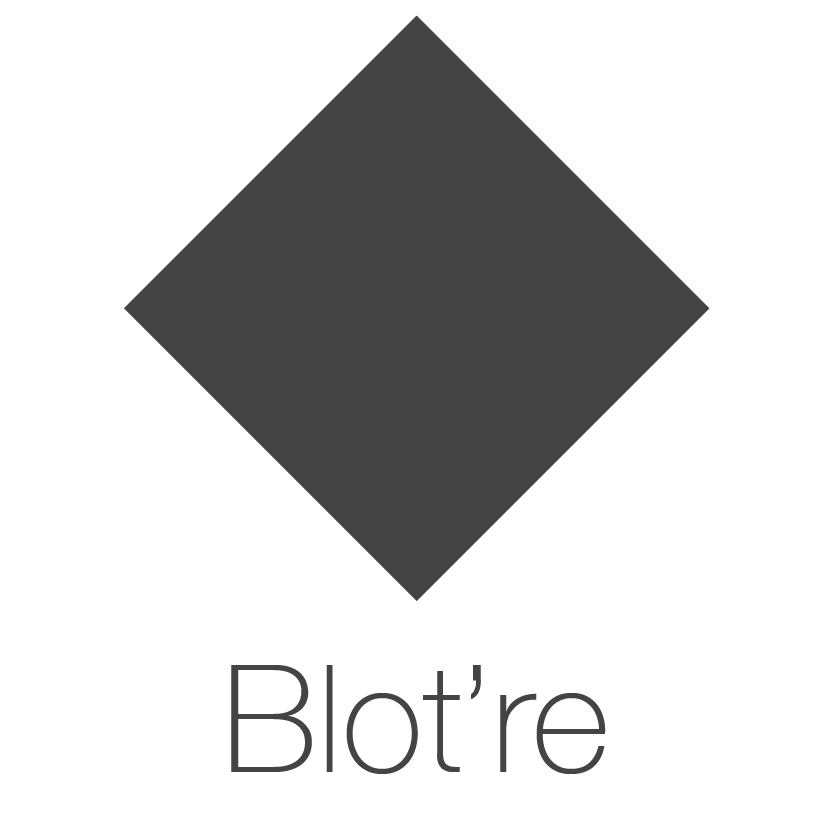

<div align="center">
    <a href="https://blot.re">
        
    </a>
</div>

Blot’re is a status oriented, IoT ready, social communications platform.

Long story short, Blot’re is what’s happening now. The past is dead. Nobody’s got time for text. Blot’re is communication reimagined for today’s hyperconnected, always on millennials. And their toasters.

#### I still don't understand
An analogy perhaps:

* Take Facebook. Now subtract out the newsfeeds, friends, photos, like buttons, messaging, profiles, videos, groups, advertising platform, etc. That’s Blot’re.
* Think Instagram, except with 1x1 images and all your follower’s are household appliances.

But it’s so much more than just another Facebook or Twitter clone.

Blot’re is the world’s first IoT ready social network. By 2016, literally everything, including your toaster, will connect to the internet. So much new data, what are we to do? Though a revolutionary context aware encoding system based on decades of machine learning, Blot’re integrates, ingests, and processes disparate data streams, outputting dense pellets of comprehensible information. All with *practically* no information loss.

#### What people are saying
But don’t take our word for it. Check out what people are saying:

> At first, I was like, WTF? This is the revolutionary new app everyone at work has been talking about? It’s soooo simple. And yet, that’s really the genius of it. I must have spent three days solid just thinking up new ways Blot’re could simplify my life.

> Perfect #996515 toast once again, thanks Blot’re!!!

> As an early adopter, I ironically liked Blot're to appear cool. But then that got too popular. Now I just like it meta ironically.


So try Blot’re today, you’ll never look back.


# API
Hey you! You, the github lurking developer with the hot new app. Yeah you! We love you. A lot.

Developers make Blot're great. So to show our wholehearted love, we've build an intuitive and powerful set of APIs for you to integrate into your application. Hook your app up to the the color graph today.

Check out [our documentation](https://github.com/mattbierner/blotre/wiki/Api) to get started.

### REST
With the [Blot're REST API](https://github.com/mattbierner/blotre/wiki/REST), you can get up and running in seconds.

If you know how to enter a url, you're already more than half way there. For example, getting a stream:

```
https://blot.re/v0/api/stream/552f25793004785713de6750
```

```
{
  "id": "552f25793004785713de6750",
  "name": "child1",
  "uri": "user/child1",
  "created": 1429153145591,
  "updated": 1429160419760,
  "status": {
    "color": "#0000ff",
    "created": 1429160419760,
    "poster": "552f24f33004785713de674e"
  },
  "owner": "552f24f33004785713de674e"
}
```

Easy.

### Authorization
GETs are boring. You live for the excitement of PUTs and POSTs, and maybe a DELETE or two. But let's not get too carried away here.

Blot're provides OAuth2 based authroization. This allows users toauthorize your app to change their data over both the REST and websocket based APIs. Checkout [our detailed walkthough](https://github.com/mattbierner/blotre/wiki/Authorization) that covers how to register a new client application, recieve authorization from a user, and make authorized requests.

### Websockets
Did you order some realtime with that?

Blot're is realtime first and your app should be too. [Our websocket subscription API](https://github.com/mattbierner/blotre/wiki/subscriptions) allows your app to recieve real time updates. Subscribe to a single stream or a collection of stream.

We also provide methods a [websocket based response API](https://github.com/mattbierner/blotre/wiki/Web-Socket-Response-API) that can perform most of the same operations as the REST API.


# Development
Blot're  uses the [Play! Framework][play].

### Config
To get your very own copy of Blot're up and running, you'll have to make just a few config changes. Not that we aren't BFFs and all. But even friends shouldn't share their client secretes.

In `conf/play-authentication/mine.conf` replace the `XXX` with your credentials. And for production you may want to chaing the `application.secret` in `conf/application.conf`. We're not saying the current one is insecure or anything, but variety is always good.

You can add these in `FILE.prod.conf` and `FILE.test.conf` files and Blot're will automatically pick them up.

### Deployment

```
# Development
$ activator run

# Production
$ activator start
```


[play]: https://www.playframework.com
[develop]: https://github.com/mattbierner/blotre/wiki
